[RU](README.ru.md)
# Circles test

## Author [@DeltaDesignRus](https://github.com/DeltaDesignRus)

## Printer version: Any

## Status: Tested

# Mod Description:
This torture test used to check your print correctnes on high speeds and accelerations, In some cases (weak details, incorrect assembly, loose belts, etc) print head could not follow proper path and can skid from traectory. This model shows all imperfections if any and you may found whein that direction issue is, X or Y or both

## Expected outcomes:
* Circles are even in all directions
* Begining and eand of each perimeter line is the same
* No gaps along perimeters
* Dimesionally accurate 
* All circles and square sizes are same in all directions

## How to use this model:

* Use prusa slicer.
* 4 perimeters
* Seam position - rear
* Fan speed - 100%
* Better to use dark PETG
* Speed 120 for everything
* Acceleration from 5k
* Better to decrease height of the model in slicer to 0.5-1mm
* Extrusion multiplier (flow) - 0.9-0.8, should be no overextrusion, but not too much underextrusion also

## Examples:
Good one:  
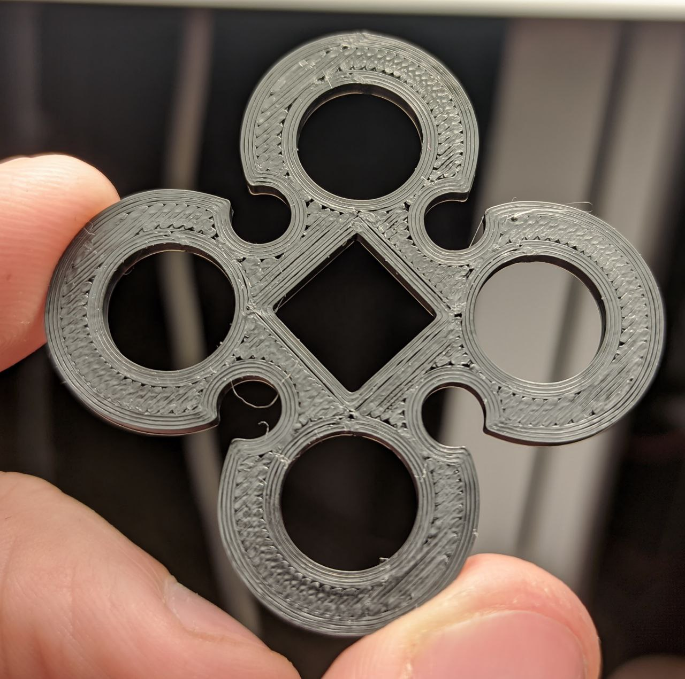  
Defect Examples:  
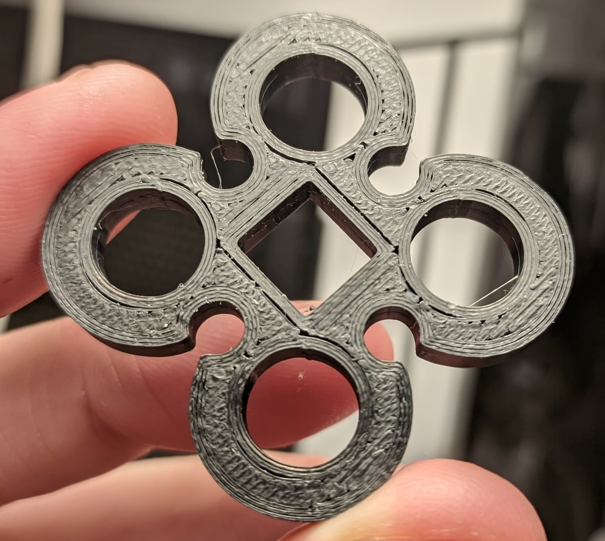 
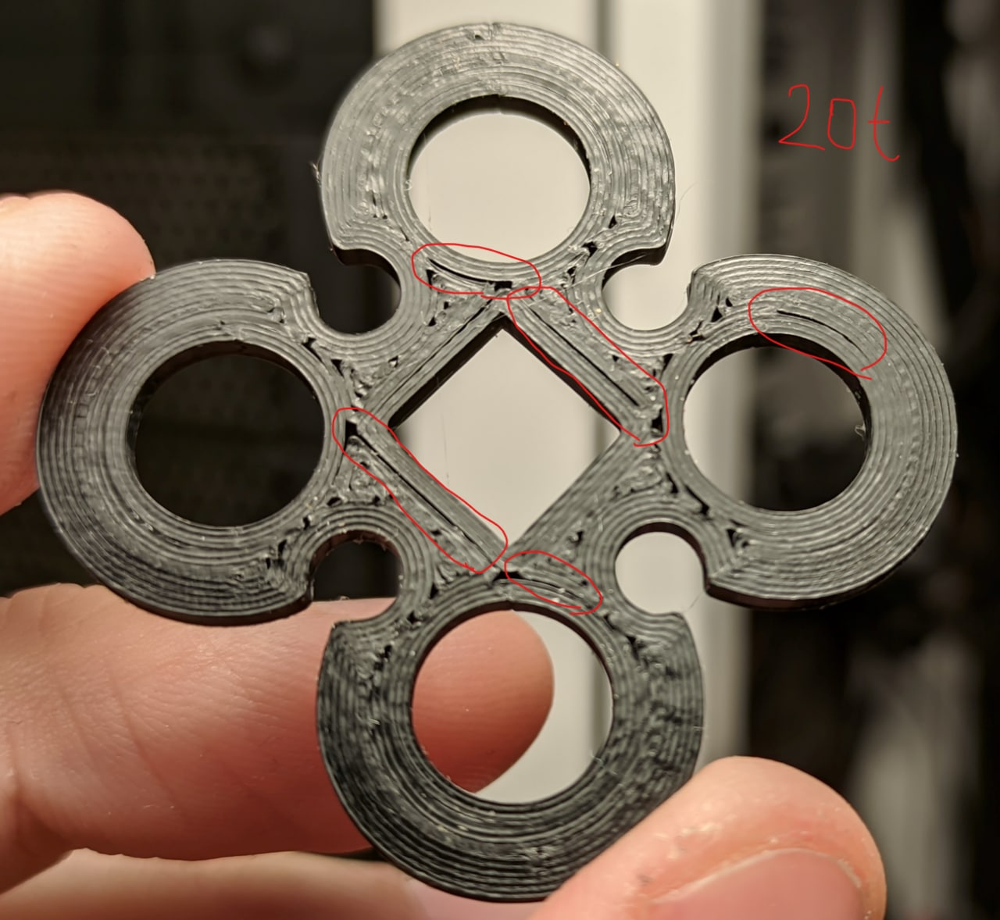 
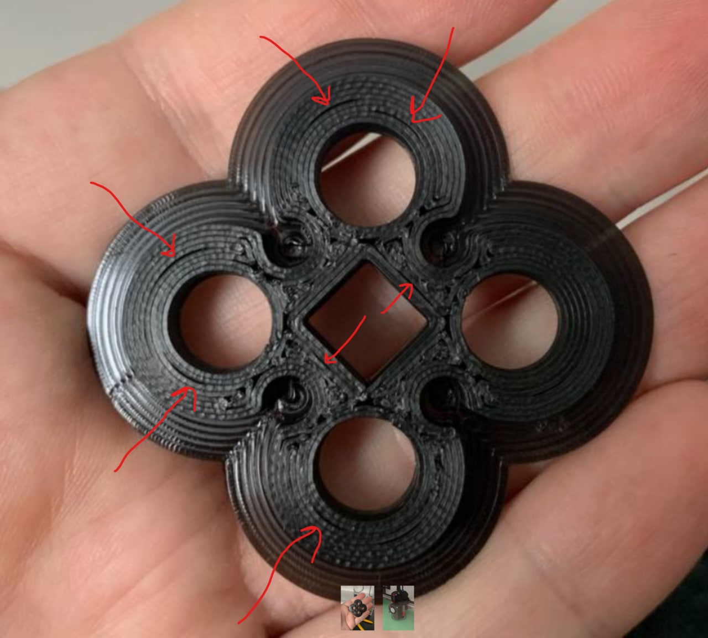 
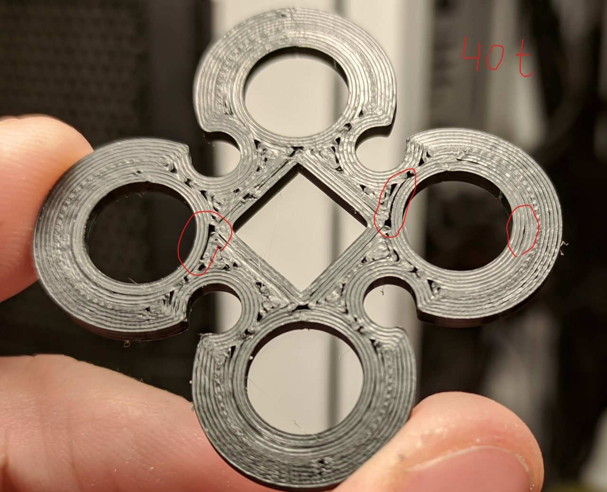 

# How to prepare and share photos in help channel:
Let say you are using Ikea lamp like this:  
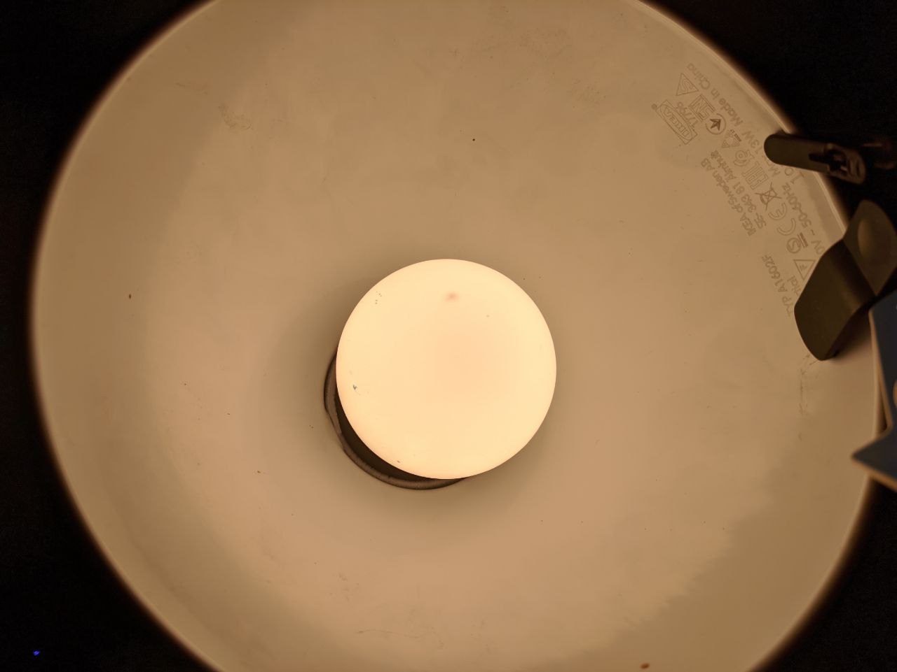  
You need to place model under the light but it is important for bulb itself do not reflect on the model, so model should feflect light from lamp diffuser.   
Wrong:   
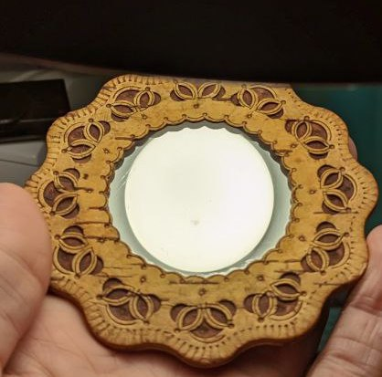 
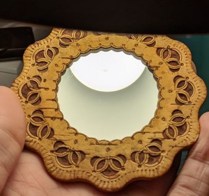 
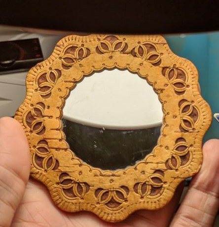

Right:  
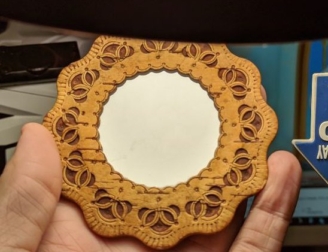
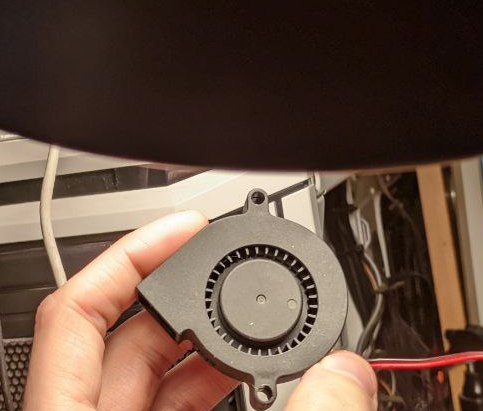

If you will do it right you will have even light on your model an it will be easier to spot any defects.