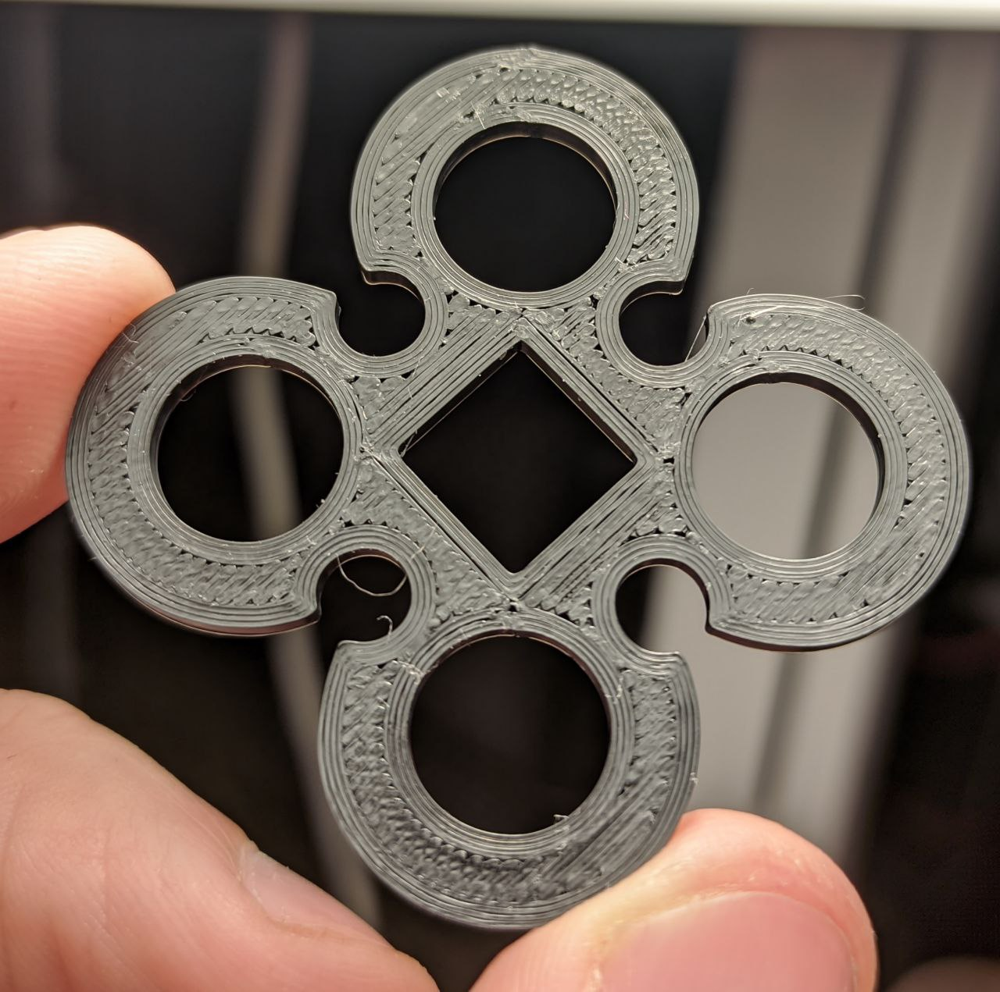
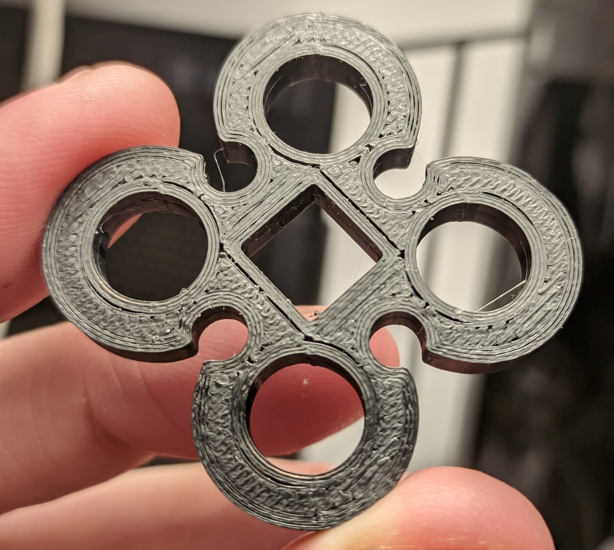
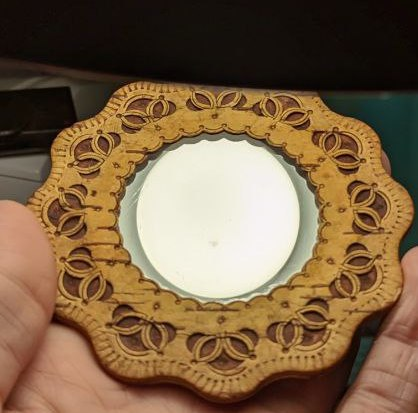
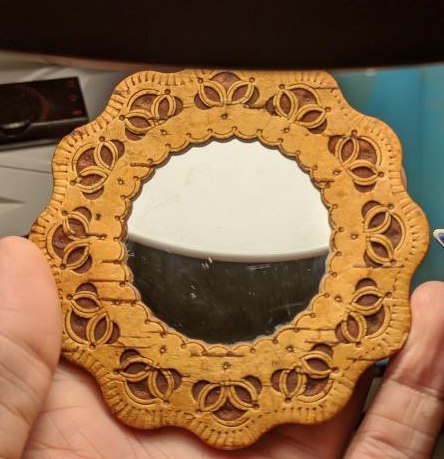

[EN](README.md)
# Тест кругов

## Автор [@DeltaDesignRus](https://github.com/DeltaDesignRus)

## Версия принтера: Любая

## Статус: Проверено

# Описание мода:
Этот тест используется для проверки правильности печати на высоких скоростях и ускорениях. В некоторых случаях (слабые детали, неправильная сборка, ослабленные ремни и т. д.) печатающая голова отклоняется от правильной траектории (заносит на скорости :). Эта модель показывает недостатки если таковые имеются, овальные круги, не точная геометрия, и тд, вы можете определить эта проблема проявляется по осиям X или Y, или по обеим.

## Ожидаемые результаты:
* Круги ровные во всех направлениях
* Начало и конец каждой линии периметра совпадают
* Отсутствие зазоров и щелей между линиями периметров
* Все размеры кругов и квадратов одинаковы во всех направлениях

## Как использовать эту модель:

* Используйте слайсер Prusa.
* 4 периметра
* Шов - сзади
* Обдув - 100%
* Лучше использовать темный PETG
* Скорость 120 для всего
* Ускорения от 5к
* Высоту модели лучше в слайсере уменьшить до 0.5-1мм
* Коэффициент экструзии (поток) - 0,9-0,8, не должно быть переэкструзии, но и не слишком много недоэкструзии.

## Примеры:
Неплохо:  
  
Примеры дефектов:  
 
 
 

# Как подготовить фото для того, чтобы вам помогли в канале поддержки:

Допустим, вы используете лампу Ikea :)  
  
Вам нужно поместить модель под свет, но важно, чтобы сама лампочка не отражалась в модели, модель должна отражать свет от рассеивателя лампы.

Неправильно:  

Правильно:  

Если вы все сделали правильно, ваша модель будет иметь равномерное освещение, и вам будет легче обнаружить любые дефекты.